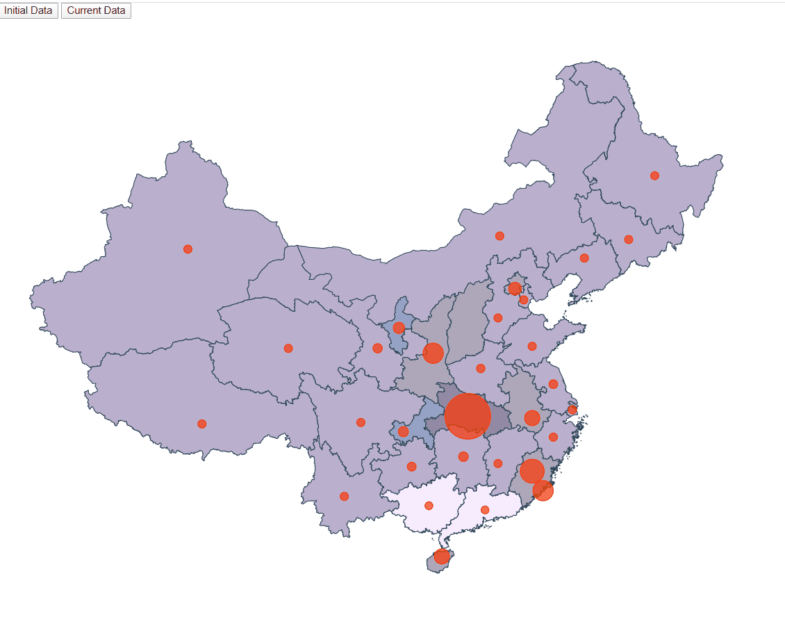

## Pinning locations + scale (China Map) +
## Update MapView (2 source data) + ColorChanges


Taking as starting point our d3js-advance task, now we want to use our knowledge to build the same
task but for other different map.

Something like this:




We have to face three topics here:

- Change the map and adapt our code 


### First Step

- Using the base our mandatory task:

    * Take as starting example https://github.com/rubennatru/d3js-advance , 
    let's copy the content from that folder and execute _npm install_.

        ```bash
          npm install
        ```
  

### Second Step

  - Change our spain.json by china.json and update your code:
 
      const chinajson = require("../data/china.json");
    
      const geojson = topojson.feature(chinajson, chinajson.objects.CHN_adm1);
  
   
   - Adapt the focus in order to see your new map right:
   
      const aProjection = d3
        .geoMercator()
        .scale(850)
        .translate([-1050, 1000]);
   
   
   
   
 ## Third Step 
 
  - Change the communities info by the new communities of the country selected(Our case China):
  
  
  
  
            export const latLongCommunities = [
              {
                name: "Anhui",
                long: 117.925,
                lat: 30.601
              },
              {
                name: "Beijing",
                long: 116.407,
                lat: 39.904
              },
              {
                name: "Chongqing",
                long: 106.553,
                lat: 29.563
              },
              {
                name: "Fujian",
                long: 117.925,
                lat: 26.484
              },
              {
                name: "Gansu",
                long: 104.286,
                lat: 35.752
              },
              {
                name: "Guangdong",
                long: 113.763,
                lat: 23.379
              },
              {
                name: "Guangxi",
                long: 108.808,
                lat: 23.725
              },
              {
                name: "Guizhou",
                long: 107.290,
                lat: 26.843
              },
              {
                name: "Hainan",
                long: 109.950,
                lat: 19.566
              },
              {
                name: "Hebei",
                long: 114.904,
                lat: 37.896
              },
              {
                name: "Heilongjiang",
                long: 128.738,
                lat: 47.122
              },
              {
                name: "Henan",
                long: 113.382,
                lat: 34.290
              },
              {
                name: "Hubei",
                long: 112.238,
                lat: 30.738
              },
              {
                name: "Hunan",
                long: 111.857,
                lat: 27.625
              },
              {
                name: "Jiangsu",
                long: 119.789,
                lat: 33.140
              },
              {
                name: "Jiangxi",
                long: 114.904,
                lat: 27.087
              },
              {
                name: "Jilin",
                long: 126.437,
                lat: 43.152
              },
              {
                name: "Liaoning",
                long: 122.529,
                lat: 41.944
              },
              {
                name: "Nei Mongol",
                long: 115.059,
                lat: 43.378
              },
              {
                name: "Ningxia Hui",
                long: 106.158,
                lat: 37.199
              },
              {
                name: "Qinghai",
                long: 96.408,
                lat: 35.745
              },
              {
                name: "Shaanxi",
                long: 109.188,
                lat: 35.394
              },
              {
                name: "Shandong",
                long: 117.925,
                lat: 35.894
              },
              {
                name: "Shanghai",
                long: 121.474,
                lat: 31.230
              },
              {
                name: "Shanxi",
                long: 118.882,
                lat: 24.938
              },
              {
                name: "Sichuan",
                long: 102.805,
                lat: 30.264
              },
              {
                name: "Tianjin",
                long: 117.177,
                lat: 39.142
              },
              {
                name: "Xinjiang Uygur",
                long: 87.540,
                lat: 42.525
              },
              {
                name: "Xizang",
                long: 88.788,
                lat: 30.153
              },
              {
                name: "Yunnan",
                long: 101.343,
                lat: 24.475
              },
              {
                name: "Zhejiang",
                long: 119.789,
                lat: 29.142
              }
            ];
      
 
 
 
### Fourth Step

  - Update the stats file, including the stats of your country (my case China):
  
          export interface InfectedEntry {
            name: string;
            value: number;
          }

          export const base_stats: InfectedEntry[] = [
            {
              name: "Anhui",
              value: 150
            },
            {
              name: "Beijing",
              value: 102
            },
            {
              name: "Chongqing",
              value: 54
            },
            {
              name: "Fujian",
              value: 322
            },
            {
              name: "Gansu",
              value: 35
            },
            {
              name: "Guangdong",
              value: 5
            },
            {
              name: "Guangxi",
              value: 7
            },
            {
              name: "Guizhou",
              value: 26
            },
            {
              name: "Hainan",
              value: 148
            },
            {
              name: "Hebei",
              value: 12
            },
            {
              name: "Heilongjiang",
              value: 10
            },
            {
              name: "Henan",
              value: 18
            },
            {
              name: "Hubei",
              value: 750
            },
            {
              name: "Hunan",
              value: 40
            },
            {
              name: "Jiangsu",
              value: 24
            },
            {
              name: "Jiangxi",
              value: 11
            },
            {
              name: "Jilin",
              value: 13
            },
            {
              name: "Liaoning",
              value: 13
            },
            {
              name: "Nei Mongol",
              value: 13
            },
            {
              name: "Ningxia Hui",
              value: 75
            },
            {
              name: "Qinghai",
              value: 13
            },
            {
              name: "Shaanxi",
              value: 250
            },
            {
              name: "Shandong",
              value: 13
            },
            {
              name: "Shanghai",
              value: 13
            },
            {
              name: "Shanxi",
              value: 250
            },
            {
              name: "Sichuan",
              value: 13
            },
            {
              name: "Tianjin",
              value: 13
            },
            {
              name: "Xinjiang Uygur",
              value: 13
            },
            {
              name: "Xizang",
              value: 13
            },
            {
              name: "Yunnan",
              value: 13
            },
            {
              name: "Zhejiang",
              value: 13
            }

          ];


          export const current_stats: InfectedEntry[] = [
            {
              name: "Anhui",
              value: 990
            },
            {
              name: "Beijing",
              value: 561
            },
            {
              name: "Chongqing",
              value: 578
            },
            {
              name: "Fujian",
              value: 322
            },
            {
              name: "Gansu",
              value: 136
            },
            {
              name: "Guangdong",
              value: 1433
            },
            {
              name: "Guangxi",
              value: 254
            },
            {
              name: "Guizhou",
              value: 146
            },
            {
              name: "Hainan",
              value: 148
            },
            {
              name: "Hebei",
              value: 319
            },
            {
              name: "Heilongjiang",
              value: 484
            },
            {
              name: "Henan",
              value: 1274
            },
            {
              name: "Hubei",
              value: 67801
            },
            {
              name: "Hunan",
              value: 40
            },
            {
              name: "Jiangsu",
              value: 638
            },
            {
              name: "Jiangxi",
              value: 936
            },
            {
              name: "Jilin",
              value: 94
            },
            {
              name: "Liaoning",
              value: 127
            },
            {
              name: "Nei Mongol",
              value: 77
            },
            {
              name: "Ningxia Hui",
              value: 75
            },
            {
              name: "Qinghai",
              value: 18
            },
            {
              name: "Shaanxi",
              value: 250
            },
            {
              name: "Shandong",
              value: 769
            },
            {
              name: "Shanghai",
              value: 433
            },
            {
              name: "Shanxi",
              value: 250
            },
            {
              name: "Sichuan",
              value: 547
            },
            {
              name: "Tianjin",
              value: 13
            },
            {
              name: "Xinjiang Uygur",
              value: 76
            },
            {
              name: "Xizang",
              value: 13
            },
            {
              name: "Yunnan",
              value: 176
            },
            {
              name: "Zhejiang",
              value: 1241
            }
          ];
  
            


## Now, We have the map working fine!!
